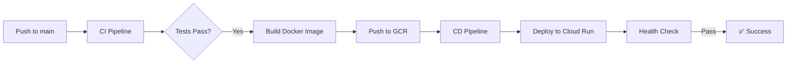

# GitHub Actions for Cloud Run Deployment

This directory contains CI/CD workflows for deploying the Football Stats Go API to Google Cloud Run.

## Workflows

### 1. CI Pipeline (`api-ci.yml`)
**Triggers**: Push/PR to `main` branch affecting `football-stats-go-api/**`

**Steps**:
- ✅ Checkout code
- ✅ Set up Go 1.24 with caching
- ✅ Download and verify dependencies
- ✅ Run linting (`go vet`)
- ✅ Build application
- ✅ Run tests with race detection and coverage
- ✅ Build Docker image (on main branch only)
- ✅ Push to Google Container Registry

### 2. CD Pipeline (`api-cd.yml`)
**Triggers**: After successful CI pipeline completion on `main` branch

**Steps**:
- ✅ Deploy to Cloud Run
- ✅ Configure auto-scaling (0-10 instances)
- ✅ Set resource limits (512Mi RAM, 1 CPU)
- ✅ Test health endpoint
- ✅ Generate deployment summary

## Required GitHub Secrets

Configure these in your repository settings:

| Secret | Description | Example |
|--------|-------------|---------|
| `GCP_SA_KEY` | Service Account JSON key | `{"type": "service_account", ...}` |
| `GCP_PROJECT_ID` | Your GCP Project ID | `my-project-123456` |
| `GCP_REGION` | Deployment region (optional) | `us-central1` |

## Quick Setup

1. **Create Service Account**:
```bash
gcloud iam service-accounts create github-actions --display-name="GitHub Actions"
```

2. **Grant Permissions**:
```bash
export PROJECT_ID="your-project-id"
gcloud projects add-iam-policy-binding $PROJECT_ID \
  --member="serviceAccount:github-actions@${PROJECT_ID}.iam.gserviceaccount.com" \
  --role="roles/run.admin"
```

3. **Generate Key**:
```bash
gcloud iam service-accounts keys create key.json \
  --iam-account=github-actions@${PROJECT_ID}.iam.gserviceaccount.com
```

4. **Add to GitHub**: Copy `key.json` content to `GCP_SA_KEY` secret

## Deployment Process



## Features

- 🚀 **Automatic Deployment**: Push to main = auto-deploy
- 🧪 **Quality Gates**: Tests must pass before deployment
- 📊 **Coverage Reports**: Automatic code coverage
- 🔄 **Zero Downtime**: Rolling updates
- 🏥 **Health Checks**: Post-deployment verification
- 📝 **Deployment Summaries**: Visible in GitHub Actions

## Monitoring Deployments

View deployments in:
- **GitHub Actions**: Repository → Actions tab
- **GCP Console**: Cloud Run → football-stats-go-api
- **CLI**: `gcloud run services describe football-stats-go-api`

## Local Testing

Test the Docker build locally before pushing:

```bash
# Build
docker build -t football-stats-go-api:local -f Dockerfile .

# Run
docker run -p 8080:8080 football-stats-go-api:local

# Test
curl http://localhost:8080/health
```

## Customization

### Change Resource Limits
Edit `api-cd.yml`:
```yaml
--memory 1Gi \
--cpu 2 \
```

### Add Environment Variables
Edit `api-cd.yml`:
```yaml
--set-env-vars "VAR1=value1,VAR2=value2" \
```

### Add Secrets (from Secret Manager)
```yaml
--set-secrets "DB_PASSWORD=db-password:latest" \
```

### Change Region
Update `GCP_REGION` secret or modify workflow default

## Troubleshooting

### Build Fails
- Check Go version compatibility
- Verify `go.mod` and `go.sum` are up to date
- Ensure all imports are available

### Deployment Fails
- Verify GCP service account has `run.admin` role
- Check if Container Registry API is enabled
- Ensure image was successfully pushed to GCR

### Health Check Fails
- Verify `/health` endpoint returns 200 OK
- Check Cloud Run logs for errors
- Ensure port 8080 is properly exposed

## See Also

- [Full Deployment Guide](../DEPLOYMENT.md)
- [Cloud Run Documentation](https://cloud.google.com/run/docs)
- [GitHub Actions Documentation](https://docs.github.com/en/actions)
